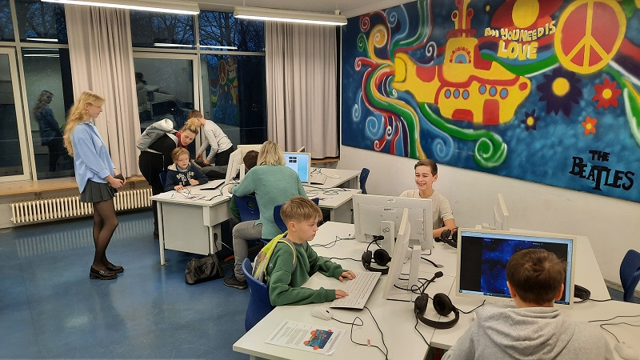
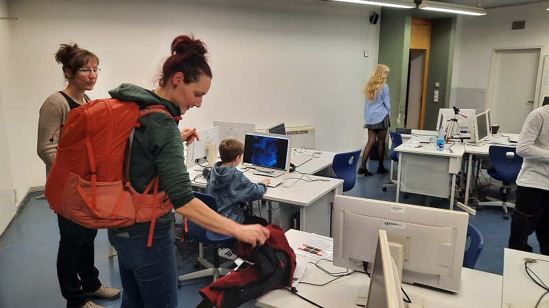
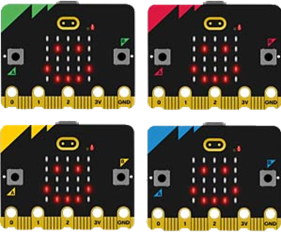
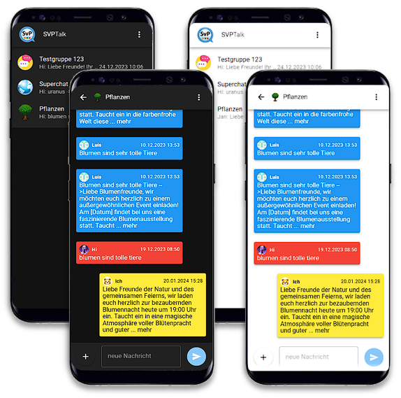
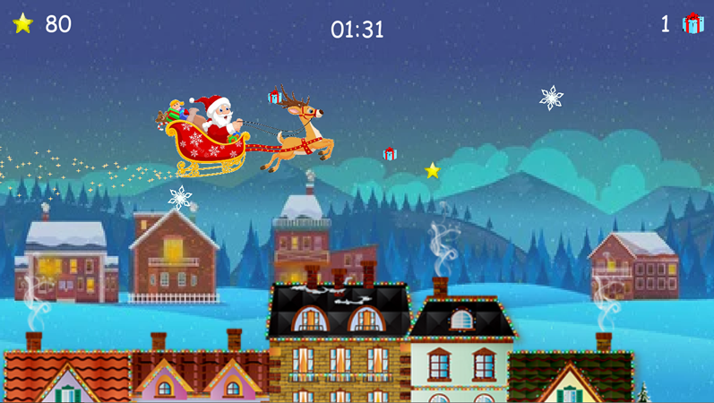

# 2.2.24 - Tag der offenen Tür

## Einleitung
Zum "Tag der offenen Tür" stellt sich die "GTA Computer" vor. Dazu präsentiert die GTA einige ihrer Projekte der vergangenen Jahre im Raum 2.06 in der Zeit von 15:00 bis 18:00.

## Eindrücke
Die "GTA Computer" konnte sich zum "Tag der offenen Tür" erfolgreich präsentieren. Es kamen viele interessierte Besucher und informierten sich über die ausgestellten Exponate und die Arbeit der GTA.

Am Preis-Quiz haben knapp 20 Mitspieler teilgenommen, von denen auch viele an der Verlosung unserer 4 "micro:bit" teilgenommen haben. Die 4 Gewinner sind mittlerweile ausgelost und freuen sich bereits über ihren neuen Mini-Computer.

Großen Zulauf hatte natürlich auch unsere Spiele-Ecke mit "Asteroids" und "Santa Claus". Hier wurde so mancher Highscore aufgestellt.

Auch unsere Programmier-Station wurde gut besucht. Viele Schüler machten hier ihre ersten Programmiererfahrungen und selbst manche Eltern staunten da nicht schlecht.

## Preis-Quiz
Für die Besucher steht ein einfaches [Online-Quiz](https://forms.office.com/r/QvAaquLWnt) zu Fragen rund um die Themen Computer, Internet und Programmierung zur Verfügung. Das Quiz kann von den Besuchern am eigenen Smartphone oder an zwei Arbeitsplätzen absolviert werden.

Optional können die Teilnehmer durch Angabe einer Email Adresse an der Verlosung von 4x "micro:bit" teilnehmen. Die Gewinner werden nach der Veranstaltung ermittelt und informiert. Der Rechtsweg ist ausgeschlossen.

## Exponate

Die Arbeit der GTA wird an verschiedenen Stationen in Form von Exponaten präsentiert. Zu jedem Exponat gibt es passende Steckbriefe in gedruckter Form. Jeder Stand wird durch Mitglieder der GTA betreut. Am Eingang wird es eine Übersicht aller vorgestellten Exponate geben.

### GTA Slide Show
Auf einem Computer werden Themen der "GTA Computer" der letzten Jahre in Form einer Slide Show präsentiert. Die Themen reichen von allgemeiner Programmierung über Python und JavaScript bis hin zu Softwareentwicklung und komplexen Web-Applikationen.

### SvP Talk

Das aktuelle Projekt beschäftigt sich mit der Entwicklung einer Web-Applikation. Bei [SvPTalk](https://svptalk.web.app) handelt es sich um eine Chat-App mit Funktionen wie WhatsApp on Co. Am Exponat wird der aktuelle Stand der Entwicklung gezeigt. Dazu gehören Funktionen, wie die Echtzeitkommunikation und die KI-Funktionen.

### Smart Camera
Ein Projekt aus dem Jahre 2021/2022 beschäftigte sich mit der Nutzung von Bildverarbeitung für eine praktische Problemstellung. Am Stand wird die intelligente Kamerasteuerung live mit Hilfe einer WebCam und dem dazugehörigen Python-Programm demonstriert.

### Asteroids
Dieses Browser-Spiel wurde 2022 im Rahmen der "Web Programmierung" mit HTML und JavaScript umgesetzt. Am Stand kann das [Asteroids](../asteroids) mit Kopfhörer von den Besuchern gespielt werden. Highscores werden vom Standbetreuer dokumentiert.

### Santa Claus

Dieses Spiel wurde 2021 im Rahmen der "Python Programmierung" umgesetzt. Am Stand kann das Spiel mit Kopfhörer von den Besuchern gespielt werden. Highscores werden vom Standbetreuer dokumentiert.

### micro:bit
Am Stand haben die Besuche die Möglichkeit, in einer grafischen Umgebung mit Simulator, erste eigenen Programmiererfahrungen zu machen. Basis stellen die Einplatinen-Computer "micro:bit" dar. Dazu stehen [Anleitungen](https://janobi7.github.io/makecode-tutorials/) zur Verfügung. Standbetreuer stehen zur Unterstützung bereit. Zur Demonstration der vielfältigen Möglichkeiten des "micro:bit" stehen 4 Geräte mit verschiedenen Beispiel-Apllikationen zum Ausprobieren bereit.

### GTA Web-Site
An zwei Arbeitsplätzen können Besucher sich über die Themen und Projekte der "GTA Computer" informieren. Hierfür wird die [Web-Site](/gta-computer) der GTA im Browser angezeigt.

## Steckbriefe

- [Asteroids](Asteroids.pdf)
- [Santa Claus](SantaClaus.pdf)
- [micro:bit](microbit.pdf)
- [Quiz](Quiz.pdf)
- [SmartCam](SmartCam.pdf)
- [SvP Talk](SvPTalk.pdf)
