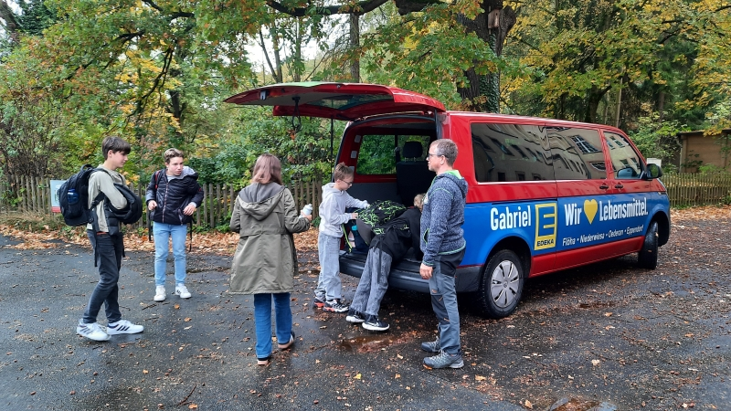
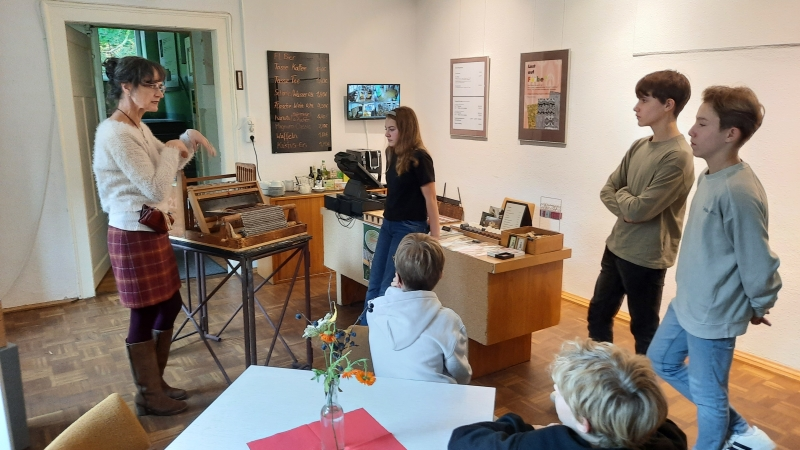
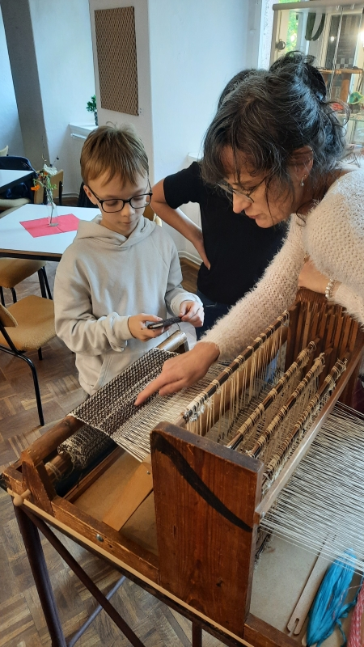
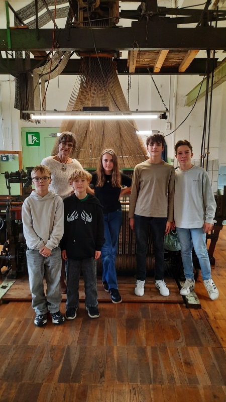
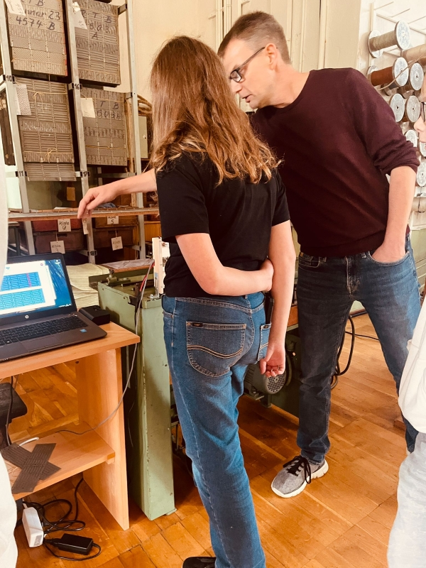
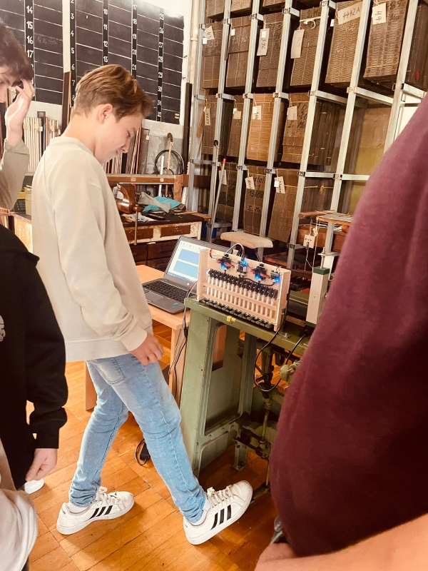
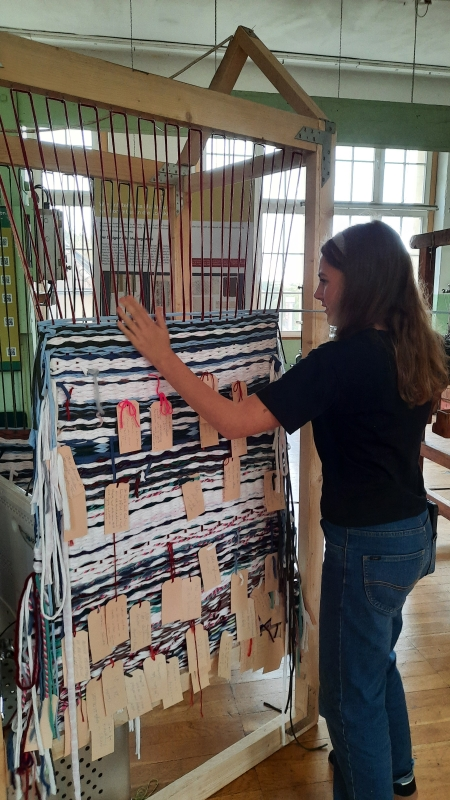

# 22.10.25 - Einführungsworkshop

## Einleitung
Der Schwerpunkt in der [GTA 2025/2026](/2025/) lag auf dem Thema Digitalisierung. Dazu gab es eine Zusammenarbeit mit der [Historischen Schauweberei Braunsdorf](https://historische-schauweberei-braunsdorf.de/).

In einem ersten Workshop im Museeum erfuhren die GTA-Teilnehmer Wissenswertes über die Grundlagen und die Geschichte des Weben. Es gab einen Überblick über den gesamten Prozess von der Designidee, über die Musterpatrone, die Lochkarten, bis hin zum fertigen Stoff.

## Eindrücke
Los ging es 13:00 Uhr ab der Schule. Mit einem Kleinbus des Fördervereins der Schule fuhren wir zum Museum nach Braunsdorf.

Dort wurden wir von der Museumsleiterin Frau Hilsberg begrüßt.

Die erste Station war ein kleiner Handwebrahmen. An diesem konnten die Schüler lernen, wie ein Gewebe entsteht und selbst ihre ersten Fäden Weben. 

Weiter ging es in den großen Maschinensaal. Hier konnten die Schüler die Geschichte und die Entwicklungen in der Weberei nachvollziehen, von den ersten Anfängen bis zu einem lochkartengesteuerten Jacquard-Webstuhl.

Ein Highlight war mit Sicherheit, einen voll funktionsfähigen Jacquard-Industriewebstuhl in Aktion zu erleben. Es ist immer wieder beeindruckend zu sehen, wie eine solche sehr laute und gewaltige Maschine solche zarte und wunderschöne Stoffe hervorbringt.

Danach wurde das Projekt "JacqSuite" vorgestellt, mit dem alte Muster digitalisiert und über automatisiert gestanzte Lochkarten wieder auf den historischen Webstühlen hergestellt werden können.

Nach der Erklärung der Funktionsweise, durften die Schüler selbst Lochkarten auf einer alten Stanzmaschine herstellen und konnten so erleben, wie eine historische Maschine und ein moderner Computer Hand in Hand arbeiten können.

Zum Abschluss konnten die Schüler noch einige Zeilen in einen besonderen Webrahmen anlässlich des Chemnitzer Kulturhaupstadtjahrs einfügen.

Allen Teilnehmern haben die 2 Stunden im Museum großen Spaß gemacht.
