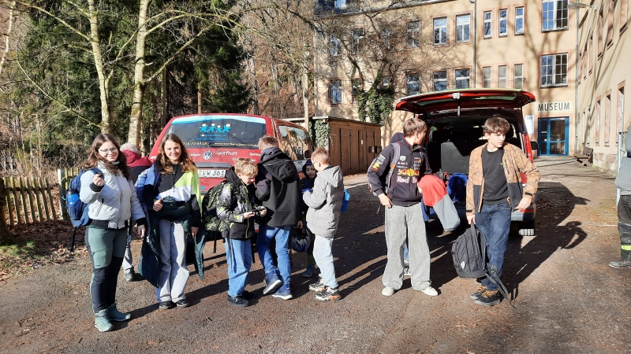
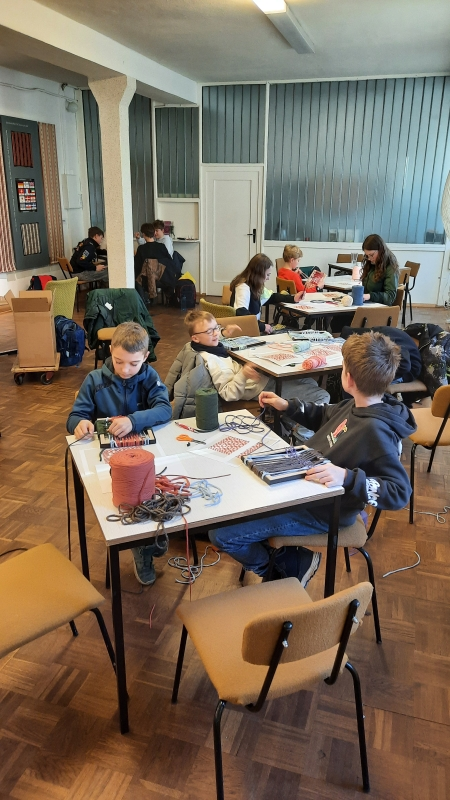
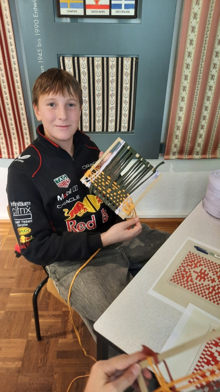
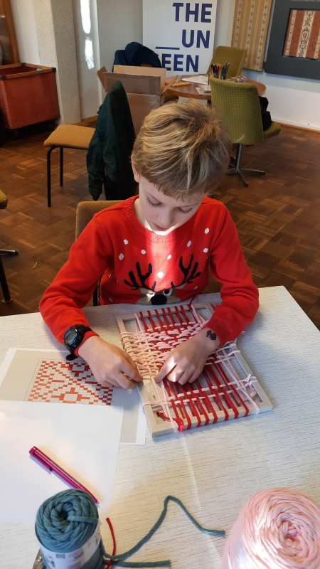
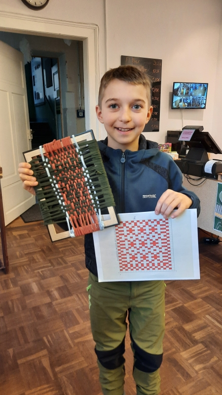
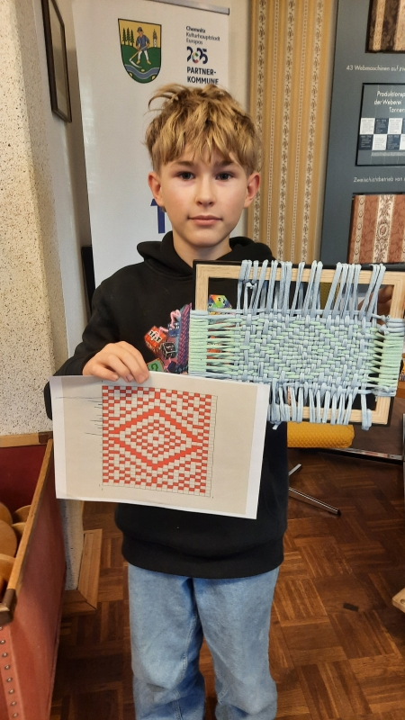
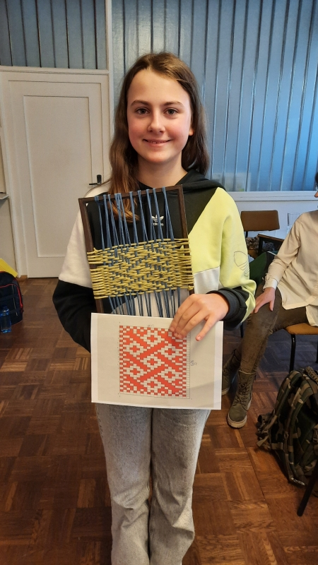

# 21.01.26 - Kreativworkshop

## Einleitung
Der Schwerpunkt in der [GTA 2025/2026](../2025) lag auf dem Thema Digitalisierung. Dazu gab es eine Zusammenarbeit mit der [Historischen Schauweberei Braunsdorf](https://historische-schauweberei-braunsdorf.de/).

In einem zweiten Workshop im Museeum konnten die GTA-Teilnehmer selber kreativ werden. Dazu brachten sie ein zuvor selbst erstelltes digitales Web-Muster auf einen Handwebrahmen.

## Eindrücke
Los ging es 13:00 Uhr ab der Schule. Mit zwei Kleinbussen des Fördervereins der Schule fuhren wir zum Museum nach Braunsdorf.

Die Schüler hatten mit der Software JacqSuite vorab eigene Musterentwürfe erstellt.

Los ging es mit einer kurzen Einweisung in der ehemaligen Kantine der Weberei. Jeder Schüler konnte sich eigene Fadenmaterialien und einen Webrahmen aussuchen.

Dann wurde konzentriert nach den eigenen Entwürfen losgearbeitet. Die Zwischenergebnisse sahen schon vielversprechend aus.

Nach 3 Stunden fleißigem Weben konnten stolz die ersten fertigen Kunststücke präsentiert werden.

Mit der Heimfahrt ging dieser Workshop erfolgreich zu Ende.
